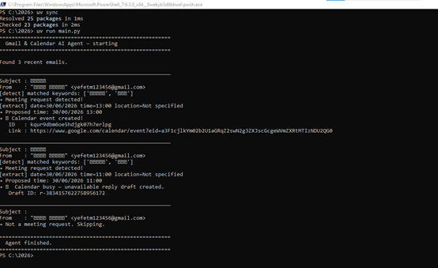

# Gmail Calendar AI Agent

## 📌 תיאור הפרויקט

מערכת AI שפותחה בפייתון ומשלבת את Gmail API ואת Google Calendar API.

המערכת סורקת הודעות דוא"ל חדשות, מזהה באופן אוטומטי בקשות לפגישה, מחלצת את פרטי הפגישה (תאריך, שעה ונושא), בודקת את זמינות היומן ומבצעת אחת מהפעולות הבאות:

- יצירת אירוע חדש ב-Google Calendar כאשר היומן פנוי.
- יצירת טיוטת תשובה ב-Gmail כאשר היומן תפוס.

---

## ⚙️ טכנולוגיות

- Python
- Gmail API
- Google Calendar API
- Google OAuth 2.0
- Google API Client

---

## 📁 מבנה הפרויקט

```
main.py                  - קוד המערכת
gmail_calendar_skill.md  - Skill
PRD.md                   - מסמך דרישות
PLAN.md                  - תוכנית עבודה
TODO.md                  - רשימת משימות
README.md                - תיעוד הפרויקט
```
---

# 🏗️ ארכיטקטורת המערכת

המערכת בנויה ממספר רכיבים העובדים יחד בצורה אוטומטית:

```text
                Gmail API
                    │
                    ▼
         קריאת הודעות דואר
                    │
                    ▼
        זיהוי בקשה לפגישה (AI Agent)
                    │
                    ▼
      חילוץ תאריך, שעה ומיקום
                    │
                    ▼
          Google Calendar API
                    │
          ┌─────────┴─────────┐
          ▼                   ▼
     היומן פנוי          היומן תפוס
          │                   │
          ▼                   ▼
 יצירת אירוע חדש      יצירת טיוטת תשובה
```

### תהליך העבודה

1. התחברות ל-Gmail באמצעות OAuth 2.0.
2. קריאת הודעות הדוא"ל האחרונות.
3. זיהוי הודעות המכילות בקשה לפגישה.
4. חילוץ פרטי הפגישה (תאריך, שעה ומיקום).
5. בדיקת זמינות ב-Google Calendar.
6. אם היומן פנוי – יצירת אירוע חדש.
7. אם היומן תפוס – יצירת טיוטת תשובה ב-Gmail.

---
---
# 📷 תיעוד פעולת המערכת

### מבנה הפרויקט


---

### יצירת טיוטת תשובה ב-Gmail

המערכת מזהה שהיומן תפוס ויוצרת טיוטת תשובה אוטומטית.


---

### הרצת המערכת

זיהוי הודעות, חילוץ פרטי הפגישה, בדיקת זמינות ביומן ויצירת אירוע או טיוטת תשובה.



---

## 🔒 אבטחת מידע

מטעמי אבטחת מידע קבצי ההרשאות האישיים אינם נמצאים במאגר:

- credentials.json
- token.json

---

## 👥 מחברים

- יפת משולם
- אדיר נחמיאס

- ---

## סיכום

המערכת פותחה בהתאם לדרישות המשימה ומשלבת עבודה עם Gmail API ו-Google Calendar API. הפרויקט מדגים תהליך מלא של קריאת הודעות, זיהוי בקשות לפגישה, קבלת החלטה על בסיס זמינות ביומן וביצוע פעולה אוטומטית בהתאם.

קורס: יישומי בינה מלאכותית בניהול  
שנת לימודים: 2026
